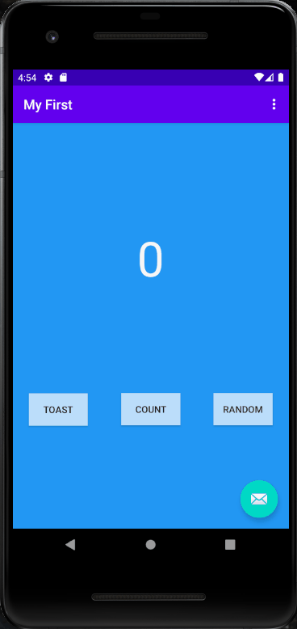

# MyFirstApp

A simple app with three buttons, one that displays a message, one that keeps a count of how many times you click it, and one that will display a random number between 0 
and the number of times you clicked the count button.

Building this app I learned how to navigate Android studio, I learned how to create interactive buttons make new pages and navigate those pages within the app. 
I also learned a bit of displaying things like strings or integers, and displaying those things.
